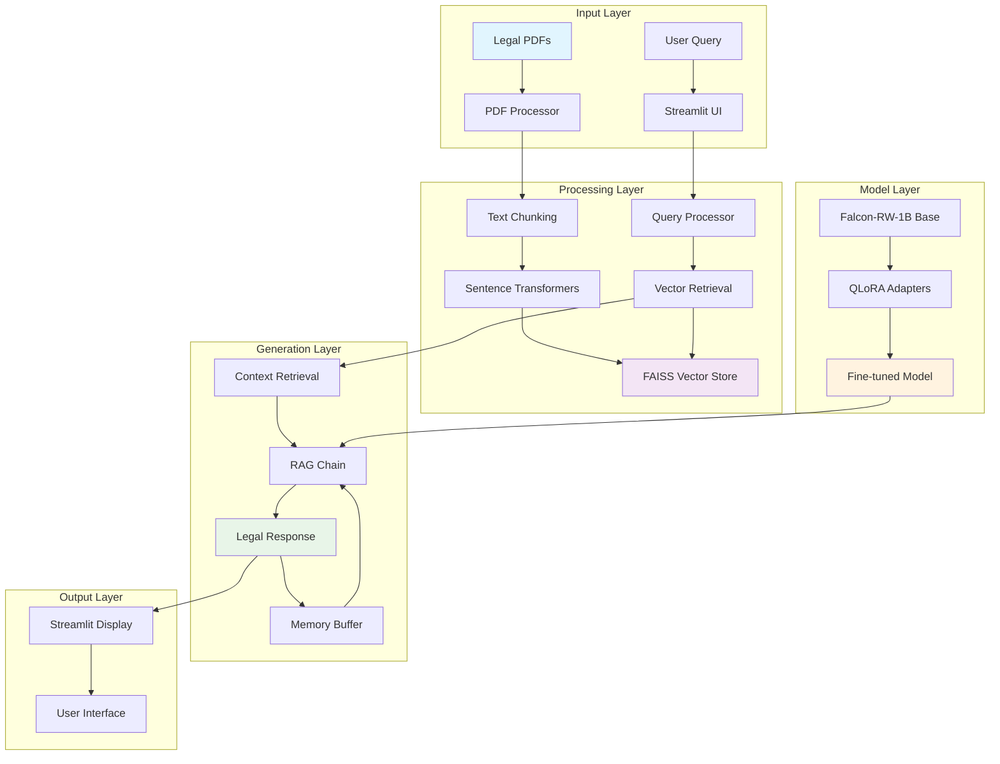
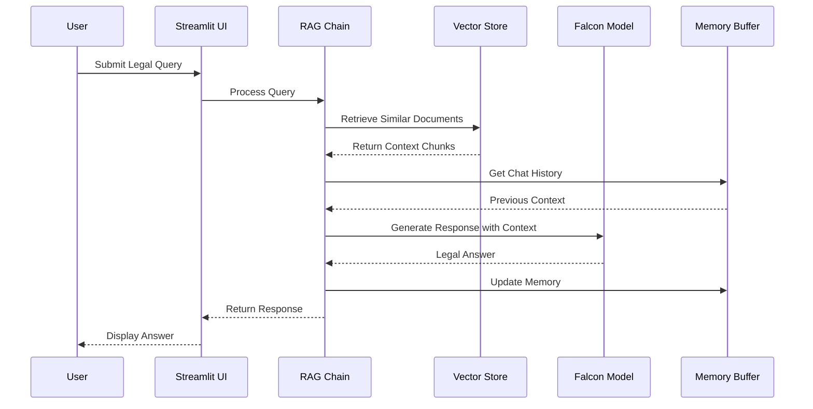
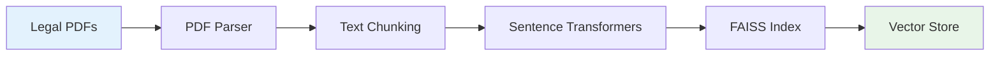
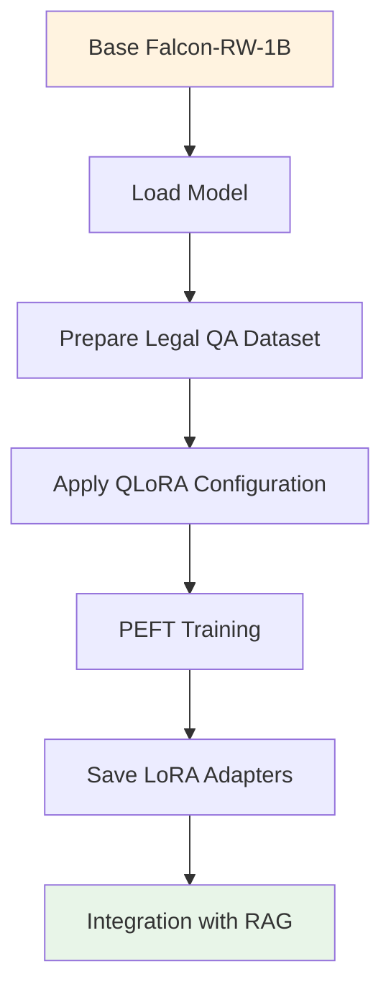

# 🏛️ LegalEase GPT: Contextual Legal Assistant

<div align="center">


*An intelligent legal assistant tailored for Indian law, combining RAG with fine-tuned language models*

</div>

---

## 🌟 Overview

LegalEase GPT is a specialized legal assistant designed to provide accurate, contextual answers to Indian legal queries. By combining **Retrieval-Augmented Generation (RAG)** with a **QLoRA fine-tuned Falcon model**, it delivers precise legal information grounded in authoritative documents like the Indian Penal Code (IPC) and Constitution.

## 🚀 Key Features

<div align="center">

| Feature | Description |
|---------|-------------|
| 📄 **PDF Embedding** | Extracts and processes legal PDFs into structured, searchable chunks |
| 🔍 **Vector Search** | FAISS-powered semantic search with sentence-transformers |
| 🎯 **QLoRA Fine-Tuning** | Enhanced Falcon-RW-1B model with LoRA adapters |
| 💬 **Conversational Memory** | Persistent chat history with LangChain buffer memory |
| 🌐 **Streamlit Interface** | Intuitive web UI for seamless legal consultations |
| 💾 **Session Persistence** | Automatic chat state management and restoration |

</div>

---

## 🏗️ System Architecture



---

## 📊 Data Flow Diagram



---

## 🔧 Installation & Setup

### Prerequisites

<div align="center">


</div>

### Step-by-Step Installation

```bash
# 1. Create and activate conda environment
conda create -n legalease310 python=3.10 -y
conda activate legalease310

# 2. Install dependencies
pip install -r requirements.txt

# 3. Set up CUDA (if using GPU)
# Ensure CUDA 12.1 is properly installed
```

### 📦 Dependencies

```txt
langchain>=0.1.0
langchain-community>=0.0.20
transformers>=4.36.0
sentence-transformers>=2.2.2
peft>=0.7.0
bitsandbytes>=0.41.0
faiss-cpu>=1.7.4  # or faiss-gpu for GPU acceleration
streamlit>=1.29.0
pymupdf>=1.23.0
pypdf2>=3.0.0
torch>=2.1.0
```

---

## 🎯 Usage Guide

### 1. 📚 Document Embedding Process



```bash
# Place your legal PDFs in the data/ folder
python embed_pdfs.py
```

**Output**: FAISS index saved in `rag/vector_store/`

### 2. 🚀 Launch Application

```bash
streamlit run streamlit_app.py
```

The app will automatically:
- Load fine-tuned model if available in `finetune/qlora-legalease/`
- Initialize vector store and memory systems
- Provide interactive chat interface

### 3. 🧪 CLI Testing

```bash
python agent/rag_chain.py
```

---

## 🎨 Fine-Tuning with QLoRA

### Training Process Flow



### Quick Start

1. **Open the fine-tuning notebook**:
   ```bash
   jupyter notebook finetune/finetune_qlora.ipynb
   ```

2. **Follow the notebook steps**:
   - Load base Falcon-RW-1B model
   - Prepare legal QA datasets
   - Configure QLoRA parameters
   - Train and save adapters

3. **Automatic Integration**:
   - Adapters saved to `finetune/qlora-legalease/`
   - RAG pipeline automatically detects and uses fine-tuned model

---

## 📁 Project Structure

```
legalease-gpt/
├── 📊 agent/
│   ├── rag_chain.py          # Main RAG implementation
│   └── memory_config.py      # Memory management
├── 📚 data/                  # Legal PDF documents
├── 🔍 rag/
│   └── vector_store/         # FAISS database
├── 🎯 finetune/
│   ├── finetune_qlora.ipynb  # Training notebook
│   └── qlora-legalease/      # Fine-tuned adapters
├── 💾 sessions/              # Chat memory storage
├── 🔧 embed_pdfs.py          # PDF processing script
├── 🌐 streamlit_app.py       # Web interface
├── 📋 requirements.txt       # Dependencies
└── 📖 README.md             # Documentation
```

---

## 💡 How It Works

### Retrieval-Augmented Generation (RAG)

1. **Document Processing**: Legal PDFs are chunked and embedded using sentence-transformers
2. **Query Processing**: User queries are converted to embeddings
3. **Context Retrieval**: FAISS performs similarity search to find relevant legal passages
4. **Response Generation**: Fine-tuned Falcon model generates contextual answers
5. **Memory Management**: Conversation history is maintained for coherent interactions

### QLoRA Fine-Tuning Benefits

- **Parameter Efficiency**: Only trains small adapter layers
- **Memory Optimization**: Reduces GPU memory requirements
- **Domain Specialization**: Tailored responses for legal terminology
- **Quick Adaptation**: Fast training on legal datasets

---

## 🎪 Demo Screenshots

### Main Interface
```
┌─────────────────────────────────────────────────────────┐
│ 🏛️ LegalEase GPT - Legal Assistant                     │
├─────────────────────────────────────────────────────────┤
│ 💬 Ask me about Indian law...                          │
│                                                         │
│ User: What are the provisions for theft under IPC?     │
│                                                         │
│ 🤖 LegalEase: According to Section 378 of the Indian   │
│ Penal Code, theft is defined as...                     │
│                                                         │
│ 📚 Sources: IPC Section 378, Related precedents       │
└─────────────────────────────────────────────────────────┘
```

---

## ⚙️ Configuration Options

### Model Parameters
- **Temperature**: 0.7 (balanced creativity/accuracy)
- **Max Tokens**: 512 (comprehensive responses)
- **Top-k**: 50 (diverse token selection)
- **Chunk Size**: 500 (optimal context retrieval)

### Memory Settings
- **Buffer Size**: 10 messages (conversation context)
- **Session Timeout**: 24 hours (persistent storage)
- **Auto-save**: Every interaction (no data loss)

---

## 🔮 Future Enhancements

- [ ] **Multi-language Support** (Hindi, Tamil, Telugu)
- [ ] **Case Law Integration** (Supreme Court judgments)
- [ ] **Legal Citation Generator**
- [ ] **Voice Interface** (Speech-to-text queries)
- [ ] **Mobile App** (React Native/Flutter)
- [ ] **Advanced Analytics** (Usage patterns, popular queries)

---

## 🛠️ Technical Notes

### Performance Optimization
- **GPU Acceleration**: FAISS-GPU for faster similarity search
- **Model Quantization**: 4-bit quantization for reduced memory usage
- **Batch Processing**: Efficient embedding generation
- **Caching**: Vector store and model weight caching

### Security Features
- **Input Sanitization**: Query preprocessing and validation
- **Rate Limiting**: Prevents API abuse
- **Session Management**: Secure chat state handling
- **Data Privacy**: Local processing, no external API calls

---

---

<div align="center">


</div>
